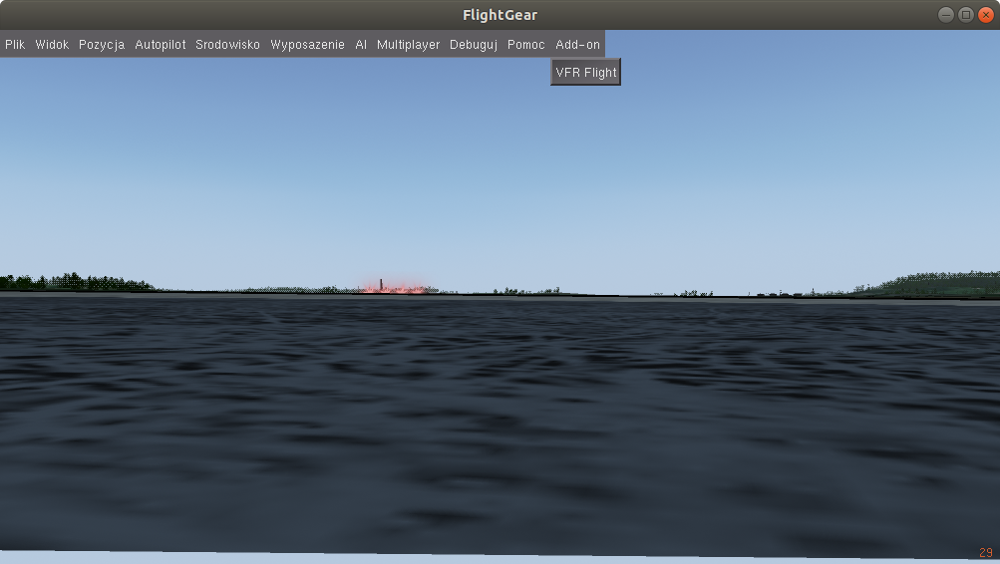
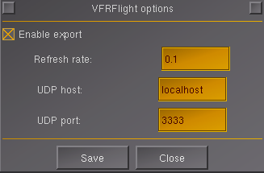
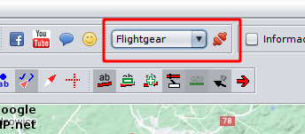
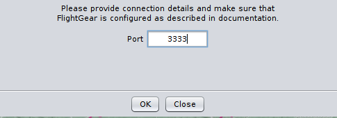

# Add-on usage

Add-on enables communication with VFRFlight software. Provides online information
of player's aircraft to the VFRFlight (http://vfrflight.org) flight planning
software.

# FlightGear configuration

Start FlightGear. Go to menu `Add-on -> VFR Flight'.

In this dialog you can enable protocol activity. When enabled the protocol is
enabled and starts serving UDP packets to the host provided in this configuration
on specified port. You can define update frequency (in Hertz) e.g. 0.1 -> each
10 seconds update will be send, 10 Hz -> every 0.1 second new update will be sent.

# VFRFlight integration

After running VFRFlight select correct flight source information (FlightGear)
and select connect button.

Configuration window will appear. From there you can define on which UDP port
VFRFlight will be listening for the FlightGear packets. It has to be the same as
in the FlightGear addon configuration !

Have fun !

